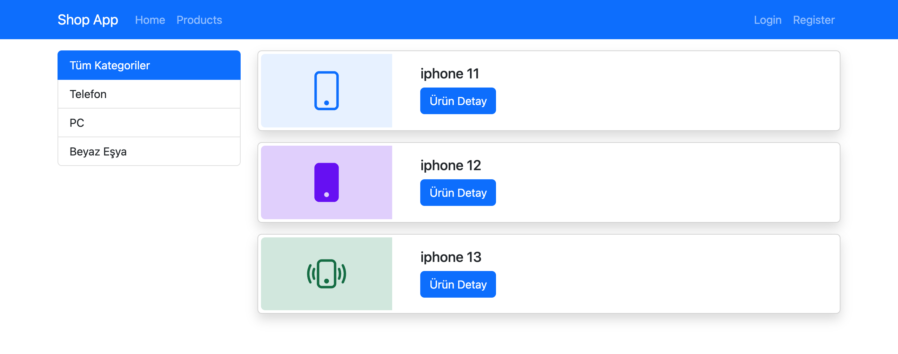
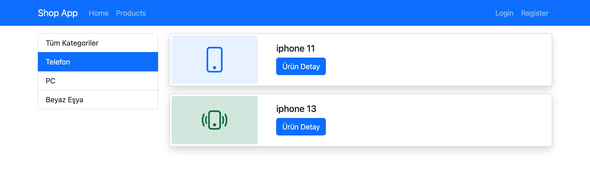
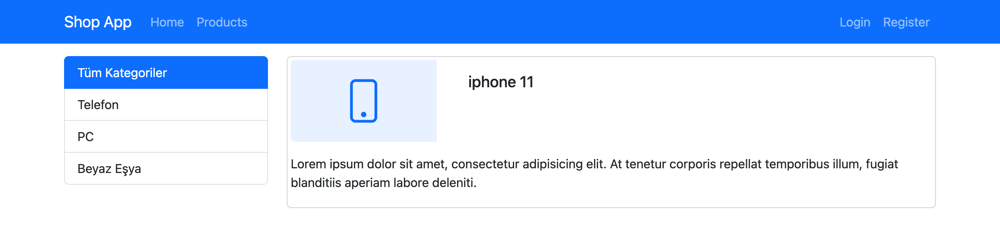
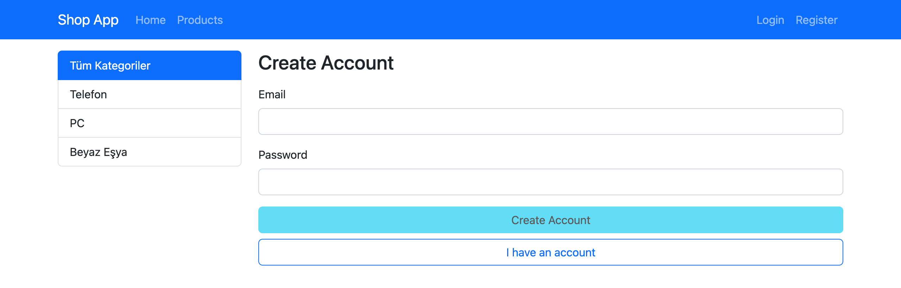
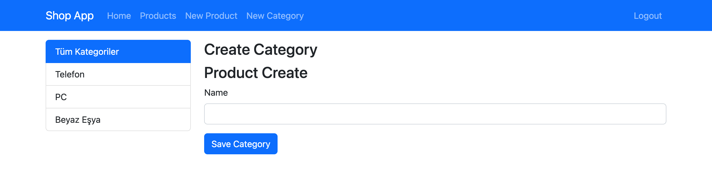
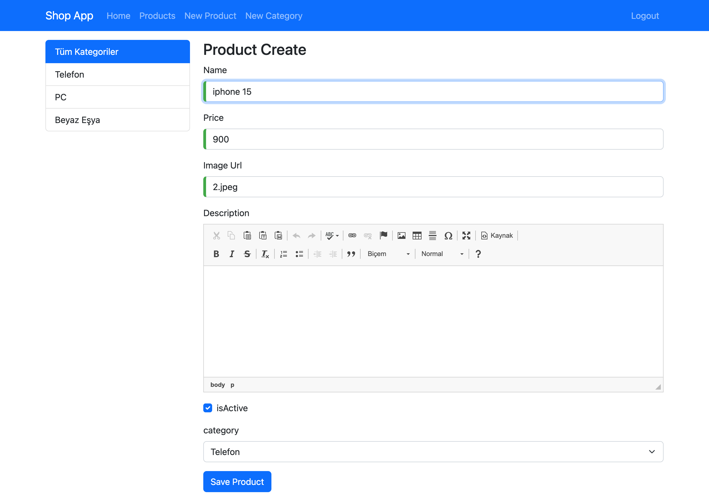

# Products Site

Products Site, Angular 14 ile geliştirilmiş tek sayfa (SPA) bir e-ticaret uygulamasıdır. Uygulama; ürün listeleme, kategori filtreleme, kullanıcı kimlik doğrulama ve yönetici yetkisine sahip kullanıcılar için ürün ve kategori yönetimi özelliklerini sunmaktadır.

## Özellikler

* Ürün listeleme
* Ürün detay sayfası
* Kategoriye göre filtreleme
* Kullanıcı kayıt ve giriş sistemi
* Çıkış yapma
* Admin yetkilendirmesi (Route Guard)
* Yönetici kullanıcılar için ürün ekleme
* Yönetici kullanıcılar için kategori ekleme
* CKEditor ile zengin metin düzenleme

## Ekran Görüntüleri

> Ekran görüntüleri örnek ürün ve kategori verileriyle alınmıştır.

### Ürün Listesi



<table>
  <tr>
    <td width="50%">
      <b>Kategoriye Göre Filtreleme</b><br>
      
    </td>
    <td width="50%">
      <b>Ürün Detayı</b><br>
      
    </td>
  </tr>
  <tr>
    <td width="50%">
      <b>Giriş / Kayıt</b><br>
      
    </td>
    <td width="50%">
      <b>Kategori Ekleme (Admin)</b><br>
      
    </td>
  </tr>
</table>

### Ürün Ekleme (Admin)



## Kullanılan Teknolojiler

* Angular 14
* TypeScript
* RxJS
* Bootstrap 5
* CKEditor 4
* Firebase Hosting

## Proje Yapısı

```text
src/app/
├── authentication/
├── categories/
├── products/
├── shared/
└── models/
```

## Kurulum

### Gereksinimler

* Node.js
* npm
* Angular CLI 14

### Adımlar

1. Repoyu klonlayın.

```bash
git clone https://github.com/kullaniciadi/Products-Site.git
```

2. Proje dizinine geçin.

```bash
cd Products-Site
```

3. Gerekli paketleri yükleyin.

```bash
npm install
```

4. Geliştirme sunucusunu başlatın.

```bash
npm start
```

veya

```bash
ng serve
```

Uygulama varsayılan olarak aşağıdaki adreste çalışacaktır:

```text
http://localhost:4200
```

## Kullanılabilir Komutlar

```bash
npm start
npm run build
npm run watch
npm test
```

## Sayfa Yapısı

* `/home` — Ana sayfa
* `/products` — Ürün listesi
* `/products/category/:categoryId` — Kategoriye göre ürünler
* `/products/:productId` — Ürün detay sayfası
* `/products/create` — Ürün ekleme (Admin)
* `/categories/create` — Kategori ekleme (Admin)
* `/account` — Giriş ve kayıt sayfası

## Notlar

* Yönetici yetkilendirmesi `AdminGuard` ile sağlanmaktadır.
* Ürün ve kategori ekleme sayfalarına yalnızca yönetici kullanıcılar erişebilir.
* Firebase Hosting yapılandırması projeye dahildir.
* Uygulama tek sayfa (SPA) mimarisi kullanmaktadır.

## Geliştirici

**hincim**
